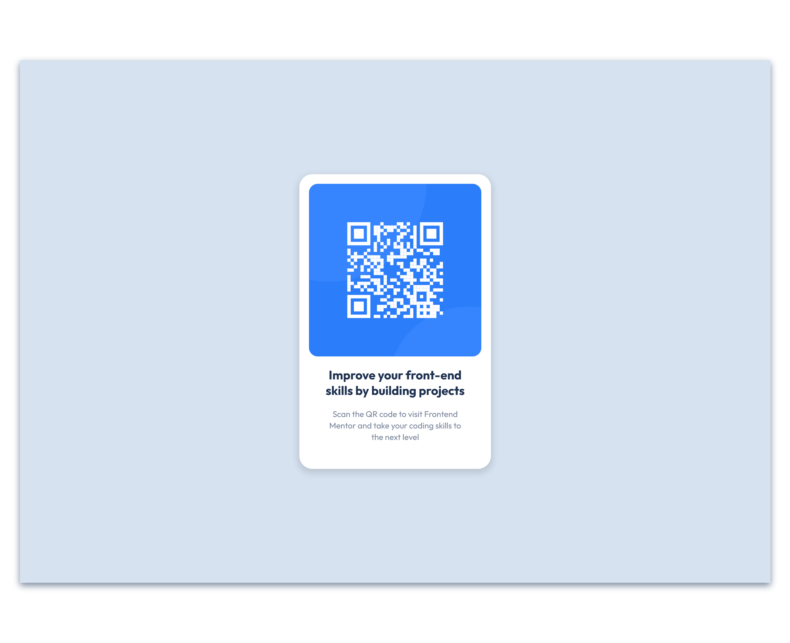

# Frontend Mentor - QR code - My Solution💫

This is my solution to the [QR code component challenge on Frontend Mentor](https://www.frontendmentor.io/challenges/qr-code-component-iux_sIO_H). Frontend Mentor challenges help you improve your coding skills by building realistic projects. 

## Table of contents

- [Overview](#overview)
  - [Screenshot](#Screenshot)
  - [Links](#links)
- [My process](#my-process)
  - [Built with](#built-with)
  - [Continued development](#continued-development)
  - [Useful resources](#useful-resources)
- [Author](#author)
- [Acknowledgments](#acknowledgments)

## Overview

### Screenshot of my solution 
_( Firefox browser )_

***
### Links

- Solution URL: [Add solution URL here](https://your-solution-url.com)

## My process

### Built with

- HTML5
- CSS
- Flexbox
***
## Author

- Frontend Mentor - [@kateryna1996](https://www.frontendmentor.io/profile/kateryna1996)

